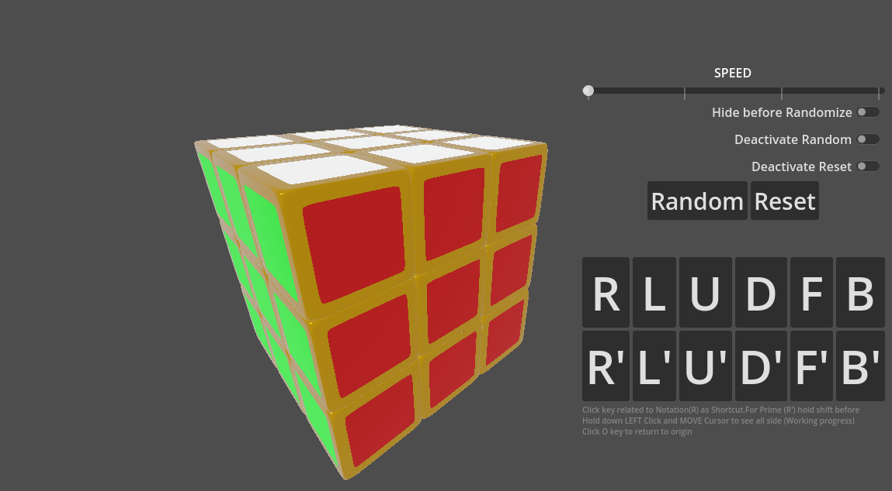

# Rubik's Cube Dojo : A Simulator

Welcome to the Rubik's Cube Dojo Simulator! This simulator allows you to solve, scramble, and explore the world of the Rubik's Cube right from your computer. Whether you're a beginner looking to learn how to solve the cube or an experienced cuber aiming to improve your skills, this simulator has got you covered.

https://github.com/SeremTitus/Rubiks-Cube-Dojo/assets/58259212/9ead0cd1-fec6-4cd7-a7a7-a1f6bc670a0e
## Contribution guidelines
- Project is currently on Godot 4.1.1 stable
- Project rendering method must remain on gl_compatability
- Blend files([Blender 3D](https://blender.org)) must remain on Blender 2.93.0

Happy cubing! 🧡🌟

 Application Icon used is Attributed to <a href="https://www.flaticon.com/free-icons/rubik" title="Rubik icons">Rubik icons created by Freepik - Flaticon</a>
 
